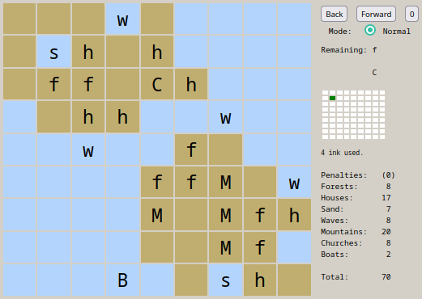

# Summary

TinyBot is a convolutional-neural-network-based AI that plays [Tiny Islands](https://dr-d-king.itch.io/tiny-islands), a solitaire game by [David King](https://dr-d-king.itch.io/) played on a 9x9 board on which the player places tiles and draws shorelines, resulting in a final score. The easiest way to become familiar with the game is to try it for a few minutes, but for reference, [README_TinyIslands.md](README_TinyIslands.md) is a formal description. TinyBot was trained using an AlphaGo-like process (a.k.a. "expert iteration") for three months using my personal computer with its $2000 NVIDIA Quadro RTX 5000 graphics card.

On a test set of 62 shuffles, TinyBot achieved a mean score of 70.7 points. A subset of those shuffles, 24 in number, was recently played by top human player [Slogo](https://www.youtube.com/watch?v=nz6x6AvM_Ks), with a mean score of 69.6 points; TinyBot's mean score on the same subset was 71.0. Although the sample wasn't large enough for the difference of 1.4 to be statistically significant, I personally think it's a credible estimate.

TinyBot's play generally matches [Slogo's 2020 strategy guide](https://imgur.com/a/yMPK279). The most interesting thing it does is that sometimes it draws an empty one-square island for the second or even the first shoreline drawing, in order to delay drawing a major shoreline. See the **Lake planning** section for more commentary, including on the degree to which TinyBot finds itself in a local maximum.

To browse and view the main results, open [tb11t.txt](tb11t.txt) with [tinylist.html](tinylist.html) ([web link](https://www.xom.io/tinylist.html)). For a description of the other game records, see [README_games.txt](README_games.txt); they aren't version-controlled, but can be downloaded in `games.zip` under **Releases** in GitHub.

# Architecture

## Background

Typically, AIs for turn-based games consist of a search algorithm and an evaluation function. The search explores and enumerates gamestates reachable from the current gamestate, and the value function allows the search to stop at intermediate gamestates without reaching the end of the game, by outputting an estimate of the win probability or score for any given intermediate gamestate.

For example, a simple search algorithm is two-ply lookahead, enumerating all current possible moves and all their possible responses. A simple value function would be to assign a fixed matériel value to each type of chess piece, and output the difference of the total value of each army.

The actual search algorithm in Deep Blue and other classical chess AIs is [alpha-beta pruning](https://en.wikipedia.org/wiki/Alpha%E2%80%93beta_pruning), which prunes inferior moves as it searches, thereby better spending its time searching deeper in the more promising branches of the gamestate tree. The value function in Deep Blue had 8000 hand-coded heuristics.

A value function can be a neural net which takes gamestate as input, and which outputs a value estimate. TD-Gammon was a 1992 AI for backgammon that used two-ply lookahead for search and a neural net for evaluation. The net was a small multi-layer perceptron with one hidden layer, trained using reinforcement learning over 1.5 million games of selfplay.

Go AIs use [Monte Carlo tree search](https://en.wikipedia.org/wiki/Monte_Carlo_tree_search), a search algorithm capable of handling variance in the value function. Before AlphaGo, Go AIs used Monte Carlo playouts for evaluation, which consist of playing from the intermediate gamestate reached via search until the end of the game using a fast "autopilot" algorithm consisting mainly of random moves, modulo some simple heuristics. Perhaps it's a little surprising that such random playouts produce reasonable value estimates, but certain properties of Go make it so. AlphaGo and its spiritual successor [KataGo](https://github.com/lightvector/KataGo) instead use a neural net for evaluation. In their case, the net is a deep residual convolutional net, a thousand times the size of TD-Gammon's net, and which outputs not only value estimates, but also move predictions which are incorporated into the Monte Carlo tree search to guide its exploration.

For a longer article, read [Love Letter to KataGo or: Go AI past, present, and future](https://brantondemoss.com/writing/kata/).

## TinyBot

TinyBot uses the same neural-net-guided Monte Carlo tree search algorithm as KataGo, except instead of stopping the search at each newly explored node of the gamestate tree, it always stops immediately before the random event of flipping cards from the deck. On tile placement turns that occur immediately before flipping, this is effectively a one-ply lookahead, except that some moves may never be explored due to the neural net guidance. As for drawing a shoreline, TinyBot uses an isomorphic representation of the task as a tree of possibilities to enable tree search while eliminating transpositions. For details, see **Interlude: on the choice of algorithm** in [the October development log](README_oct.md).

For evaluation, TinyBot performs a playout playing the net's highest-predicted move on each turn, using a random shuffle consistent with the already-observed-to-be-flipped cards. This is up to 50 times slower than directly using a neural net as evaluation function, but it was easier to implement the training of the net, since it doesn't require as much training data of positions following bad moves. Some of TinyBot's training games had up to 7 random tile placement moves before playing the rest of the game as usual; I made no attempt to generate games containing bad shorelines. My empirical finding was that this training data was adequate for predicting good moves, but not for estimating the value of bad moves.

TinyBot uses KataGo's neural net declaration code, from the new PyTorch branch, [with the inputs and outputs modified](README_net.txt). For selfplay in training, TinyBot used hyperparameters `b2c64-fson-mish-rvgl`, resulting in 150,000 trainable parameters (weights). For the final net, TinyBot used `b4c96-fson-mish-rvgl`, resulting in 750,000 trainable parameters. For comparison, TD-Gammon had 16,000 trainable parameters, and KataGo's currently in-development `b18c384nbt-fson-mish-rvgl-bnh` net has 29 million trainable parameters.

# Lake planning

As alluded to above, it's hard to explore the possibility space of possible shorelines, and I hardly even tried. One might speculate that TinyBot did no more than find the most obvious strategy, of drawing two major islands in a diagonal arrangement, and refined it to a local maximum. In the case of Tiny Islands, it seems likely that the most obvious strategy is indeed the best, but TinyBot may not be a conclusive test of that proposition.

  
*A lake at b8, containing a sand tile. (Not an early lake, in this case; the sand was played during the last third of the game.)*

Although it's hard to program TinyBot to try all possible strategies, it's not hard to get it to try something specific. At one point, after TinyBot had settled into the diagonal strategy, I noticed that it would be better off drawing a lake for the second shoreline drawing whenever it had already placed a water tile that would eventually need to be in a lake; it was a blind spot that the net had developed, always predicting major islands for the first two shoreline drawings, never a lake, which guided the search not to consider a lake. I then hardcoded it to consider the lake, which corrected the blind spot. (Afterward, I decided that, in these cases, it's always correct to draw a lake and I hardcoded it to only consider lakes, to conserve computation.)

After learning to sometimes draw an early lake, leaving a major island shoreline for last, TinyBot began to sometimes draw an early, empty one-square island (not a lake). This has the same advantage of delaying the major shoreline, but it does sacrifice potential in the area near the one-square island, unlike the early lake which is a no-brainer with almost no downside. I think TinyBot probably balances the cost and benefit well when it decides whether to do this (usually it declines).

One move I still don't think TinyBot considers is drawing an early lake in the absence of a water tile on an already-drawn island that would eventually need the lake. Granted, I think it's probably never correct. But the fact that TinyBot doesn't do it is weak evidence that it's never correct; I think it stopped considering it before it reached its current strength.

# The pattern in the deck in Tiny Islands

Contrary to the two decks initially described in [README_TinyIslands.md](README_TinyIslands.md), there is actually only one 54-card deck, with tiles on one side and zones on the reverse side. For each placement turn, the previous turn's tiles are flipped over to reveal the zones on the reverse side. Each game, the tiles on the other side of the first two zones and the zones on the other side of the last two tiles are unseen and unused.

For example, the three Boats in the deck have the topmost row, the leftmost column, and the bottom left nonant on their backs. This results in lesser Boat values than the theoretical two-deck scheme previously described, because it results in 4% fewer opportunities to play Boats in corners.

When I started developing TinyBot, I read the developer's comment describing this, but when I scrutinized the digital implementation, I mistakenly determined it not to be the case. I didn't discover my mistake until after TinyBot was done training. So TinyBot was trained using the "naive" two-deck scheme, and is not aware of the actual deck pattern. I could train TinyBot further to be aware, but I wish to move on from the project, so I won't.

For the final test run, I generated 4032 "naive" shuffles not using the actual deck pattern, and I also had 62 shuffles transcribed from the actual game, containing the actual deck pattern. TinyBot had a mean score of 72 on the naive shuffles, and 70.7 on the transcribed shuffles. Thanks to the large sample of naive shuffles, this difference is statistically significant. How much of it is due to the effect on Boats I described, versus how much of it is due to other (similar) effects, I don't know.

For what it's worth, my speculation is that actually being aware of the pattern wouldn't be useful until the last couple of turns, because knowing the next zones doesn't seem that useful without knowing the next tiles. On the last couple of turns, though, you'd have a better idea of which tiles are on the other side of the first two zones and won't be used, giving you a good guess at the last few tiles before you see them.

# More results

For the final test run, TinyBot was configured with a search threshold of 4096 playouts\*, resulting in an amortized runtime per game of 6 minutes.

(\*This 4096 is not the usual parameter. TinyBot's criterion for playing a move is when it accumulates a certain number of search visits. This is different from the typical practice of running Monte Carlo tree search until certain number of total visits have been made across all candidate moves, then playing the most-visited or highest-scoring move (which should be the same move). TinyBot's method allocates more time to more difficult choices, but it's not a big difference. I think the typical practice might be more useful in academia for holding the search time constant while comparing other variables.)

To assess the quality of the "autopilot", i.e. playing the net's highest-predicted move, without any search, I ran it on the 62 transcribed shuffles. Despite diverging from the main run at some point in each game, and despite having a near-instantaneous instead of 6-minute runtime, it also happened to score a mean of 70.7. I also tried a search threshold of 32 playouts (amortized runtime: 3 seconds), resulting in a mean score of 70.6. Although the difference is not statistically significant, it's plausible that the "too few Monte Carlo trials" of the reduced-strength bot underperform the simpler statistical model of the neural net.

I actually ran TinyBot thrice on the first transcribed shuffle (and weighted each resulting score 1/3 in the calculation of the overall mean of 70.7) to see how similar the results would be. They turned out similar, but not the same; the scores were 74, 72, and 74.

# Other approaches

The AlphaGo-like process of expert iteration is possibly overkill for the game of Tiny Islands, and a simpler, online reinforcement-learning scheme like TD-Gammon's may have sufficed. But I started this project in order to try implementing Monte Carlo tree search, and only added the neural net once that was done.

As mentioned earlier, the neural net policy rollouts, while easier to implement training for, are vastly slower than a working neural net value function would be.

I also didn't bother with the potential improvements of reduced floating-point precision, or of weight averaging, stochastic or [otherwise](https://arxiv.org/abs/2203.05482).
